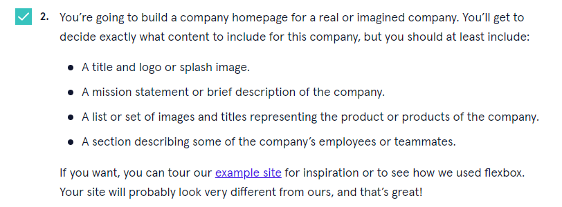
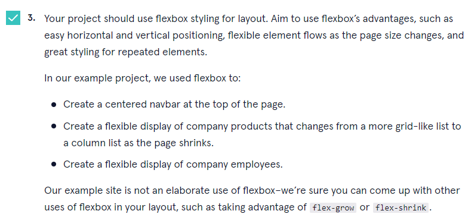
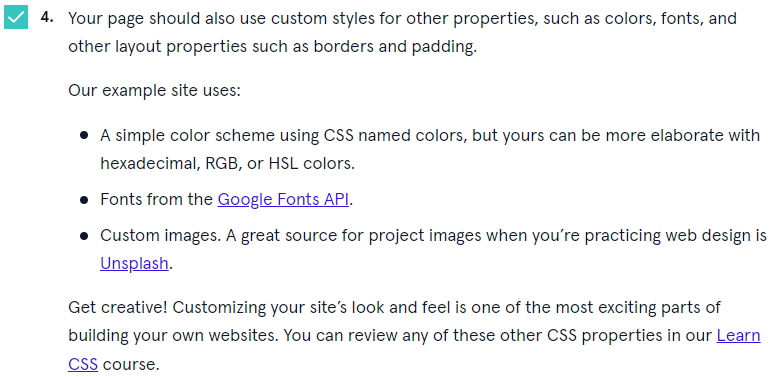

# Company Home Page 

This project is a Codecademy project. I was given a task to make a home page for a Real or Fake company. They also provided some ideas for what needs to be added to make a good company home page. Within this project, I used HTML/CSS/JS. The company I decided to use was a fake salon company.  

## Here is the Ideas / Instructions I was given. 
---

## Demo Website
---
You can view the demo website [here](https://ethanhunter7.github.io/Company-Home-Page/)
